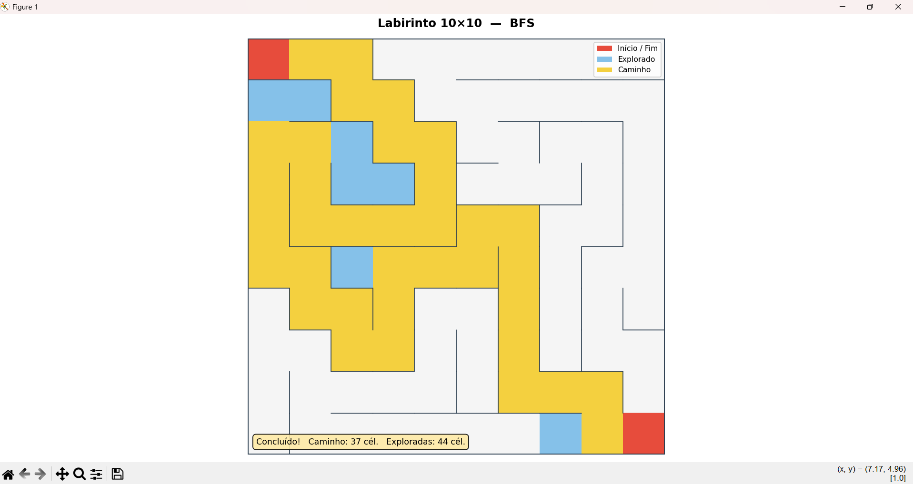
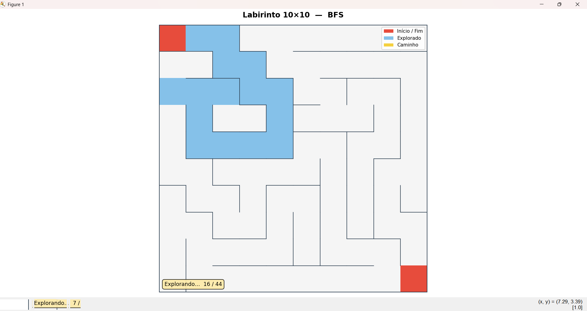
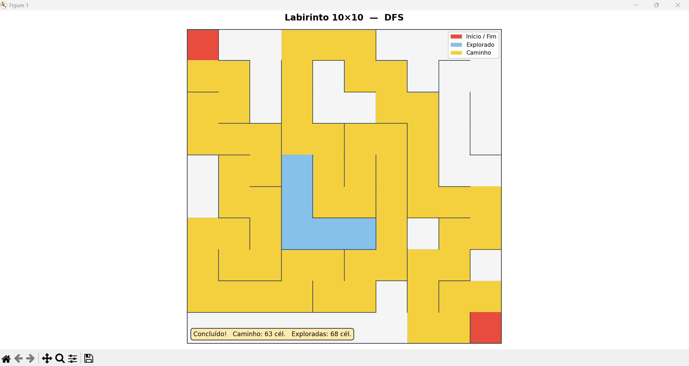

# Grafos1_Labirinto-BFS-DFS

**Número da Lista**: 1<br>
**Conteúdo da Disciplina**: Grafos 1<br>

## Alunos
|Matrícula | Aluno |
| -- | -- |
| 202016382 | Guilherme Meister Correa |
| 202063462 | Samuel Alves Silva |

## Sobre

Este projeto implementa um **gerador e solucionador de labirintos** procedurais usando algoritmos de busca em grafos.

O labirinto é gerado automaticamente pelo algoritmo **Recursive Backtracker** (DFS iterativo), que produz um labirinto perfeito — exatamente um caminho entre quaisquer duas células. Em seguida, o usuário escolhe entre dois algoritmos para encontrar o caminho de `(0,0)` até `(N-1, N-1)`:

- **BFS (Busca em Largura)** — garante o caminho com menor número de células.
- **DFS (Busca em Profundidade)** — explora fundo antes de retroceder, encontra um caminho válido (não necessariamente mínimo).

A solução é exibida em uma **animação interativa** (matplotlib) em duas fases: primeiro a exploração se expande pelo labirinto em azul, depois o caminho final é destacado em amarelo.

## Screenshots

> **Prints necessários (tire na ordem abaixo ao rodar `python main.py`):**
>
> 1. **Print 1** — Janela aberta no início da animação (labirinto todo cinza, só início/fim em vermelho).
> 2. **Print 2** — Meio da fase de exploração (célula azul se expandindo pelo labirinto).
> 3. **Print 3** — Animação concluída com o caminho final amarelo destacado.
> 4. *(Opcional)* **Print 4** — Rodada com DFS para comparar o padrão de exploração diferente do BFS.

<!-- Substitua os placeholders abaixo pelos prints tirados -->

| BFS — Exploração | BFS — Caminho Final |
|---|---|
|  |  |

| DFS — Exploração |
|---|
|  |

## Instalação

**Linguagem**: Python 3.8+<br>
**Dependências**: `matplotlib`, `numpy`

Clone o repositório e instale as dependências:

```bash
git clone https://github.com/<seu-usuario>/Grafos1_Labirinto-BFS-DFS.git
cd Grafos1_Labirinto-BFS-DFS/labirinto
pip install matplotlib numpy
```

## Uso

Execute o programa principal dentro da pasta `labirinto/`:

```bash
cd labirinto
python main.py
```

Ao iniciar, o terminal exibirá o menu:

```
=== Solucionador de Labirinto ===
Escolha o algoritmo de busca:
  1 → BFS  (Busca em Largura   — caminho mais curto garantido)
  2 → DFS  (Busca em Profundidade — explora fundo antes de retroceder)

Digite 1 ou 2:
```

1. Digite `1` para BFS ou `2` para DFS e pressione Enter.
2. O terminal imprime as estatísticas do caminho encontrado.
3. Uma janela gráfica abre com a animação — feche-a para encerrar.

## Outros

### Estrutura do projeto

```
labirinto/
├── main.py        # Ponto de entrada e menu interativo
├── maze.py        # Geração do labirinto (Recursive Backtracker)
├── solver.py      # Algoritmos BFS e DFS
└── visualizer.py  # Animação com matplotlib
```

### Legenda de cores da animação

| Cor | Significado |
|---|---|
| Cinza claro | Célula livre (não visitada) |
| Vermelho | Início `(0,0)` e fim `(N-1, N-1)` |
| Azul claro | Célula explorada pelo algoritmo |
| Amarelo | Caminho final encontrado |

### Comparativo BFS × DFS

| | BFS | DFS |
|---|---|---|
| Caminho | Mínimo (ótimo) | Válido (não ótimo) |
| Exploração | Ondas concêntricas | Mergulho profundo + retrocesso |
| Estrutura | Fila (`deque`) | Pilha (`list`) |
