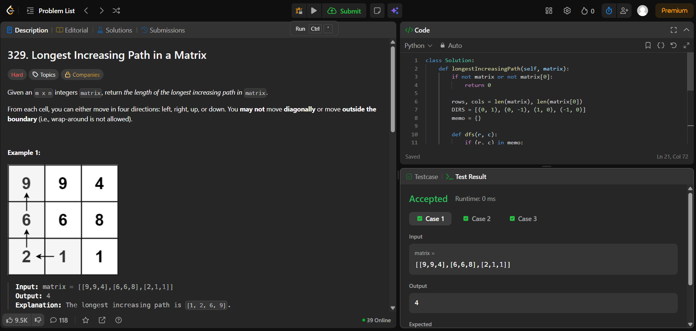
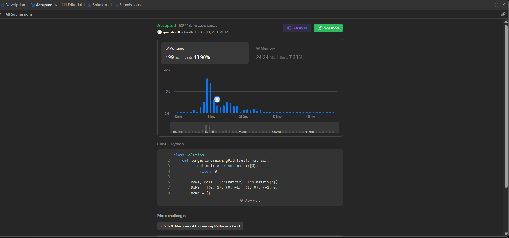
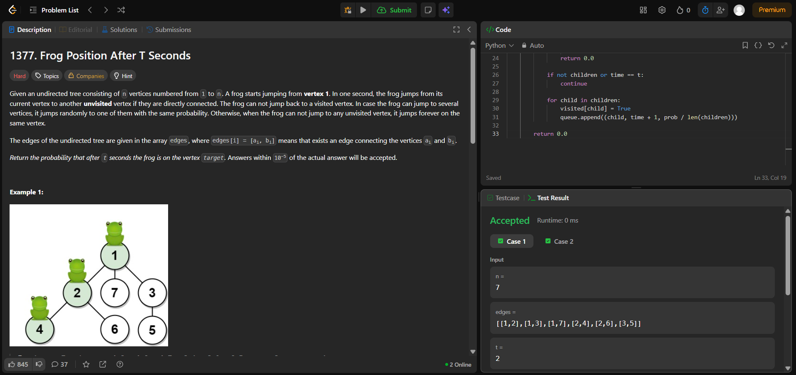
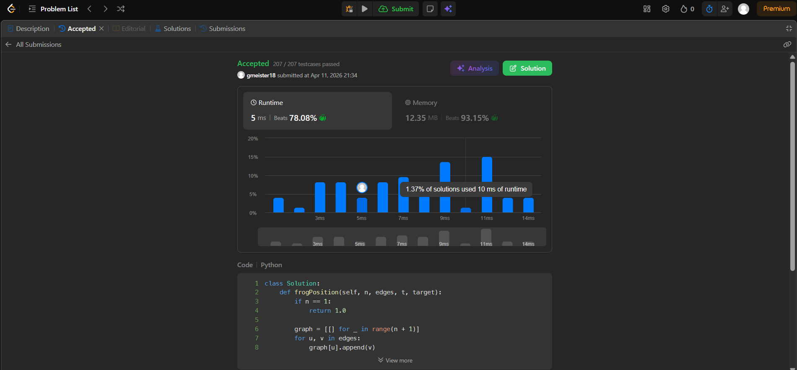

# G18_Grafos_PA-26.1

**Número da Lista**: 1 
**Conteúdo da Disciplina**: Grafos 1  

## Alunos
|Matrícula | Aluno |
| -- | -- |
| 202016382 | Guilherme Meister Correa |
| 202063462 | Samuel Alves Silva  |

## Sobre 
## LeetCode — Exercícios selecionados

Incluímos três problemas retirados do LeetCode (dois difíceis e um médio). Abaixo estão os links diretos, o código-fonte neste repositório e screenshots das submissões.

- **[329. Longest Increasing Path in a Matrix](https://leetcode.com/problems/longest-increasing-path-in-a-matrix/)** — Difícil
	- Código: [329.py](code/329.py)
	- Screenshots (clique para ampliar):
		- 
		- 

- **(Problema medio)** — Substitua este placeholder com o nome e link do problema medio.
	- Código: `code/<arquivo>.py` (substituir)
	- Screenshot: `assets/<imagem>.png` (substituir)

- **[1377. Frog Position After T Seconds](https://leetcode.com/problems/frog-position-after-t-seconds/)** — difícil
	- Código: [1377.py](code/1377.py)
	- Screenshots (clique para ampliar):
		- 
		- 

## Vídeo Explicativo

## Instalação 
**Linguagens**: Python

## Uso 
Explique como usar seu projeto caso haja algum passo a passo após o comando de execução.

## Outros 
### Informações sobre os desafios

